# html2json Implementation Plan (TDD + FP)

## Locked design contract

All implementation and tests must follow these decisions from our earlier discussion:

| Topic | Decision |
|-------|----------|
| Output shape | DOM-like AST rooted at `{ type: "document", children: [], warnings: [] }` |
| Node types | `document`, `element`, `text`, `comment`, `doctype` |
| Whitespace | Skip text nodes that are **whitespace-only between tags** in normal mode; preserve all text inside `pre`, `textarea`, `script`, `style` |
| Malformed HTML | Best-effort tree; never throw; collect recoveries in `warnings[]` |
| Warnings | Top-level sibling field: `{ message: string, position: number }` |
| Entities | Decode in text nodes and attribute values; **do not** decode in `script`, `style`, comments, doctype |
| Constraint | No DOM parser (`DOMParser`, `innerHTML`, external HTML libs) |

Example target output:

```json
{
  "type": "document",
  "children": [
    { "type": "doctype", "name": "html" },
    {
      "type": "element",
      "tagName": "div",
      "attributes": { "class": "box" },
      "children": [{ "type": "text", "content": "Hello" }]
    }
  ],
  "warnings": []
}
```

---

## Architecture (functional pipeline)

Pure functions only in the parsing core. Browser UI functions stay impure and isolated at the bottom of [html2json.js](html2json.js).

```mermaid
flowchart LR
  input["htmlText string"] --> tokenize
  tokenize["tokenize(html)"] --> tokens["Token[]"]
  tokens --> buildTree
  buildTree["buildTree(tokens)"] --> rawTree["Tree + warnings"]
  rawTree --> normalizeWs
  normalizeWs["normalizeWhitespace(tree)"] --> cleanTree["Tree"]
  cleanTree --> wrapDoc
  wrapDoc["toDocument(tree, warnings)"] --> output["JSON object"]
```



**FP rules applied throughout:**
- Each helper takes inputs and returns **new** values (no mutating shared arrays/objects in helpers)
- Parser state during tokenization/tree-building uses immutable snapshots: `{ index, tokens, stack, warnings } → nextState`
- Side effects only in browser glue: `convertHtml2JsonAndSet`, `showExample1`, `showExample2`
- YAGNI: no plugin system, no config object, no class hierarchy — plain functions + constants

**File strategy (KISS + README compliance):**
- All logic lives in [html2json.js](html2json.js) (required deliverable)
- Add a Node export guard at the bottom for TDD: `module.exports = { html2json, ...testableHelpers }`
- [index.html](index.html) keeps `<script src="html2json.js">` unchanged (globals still work)
- No build step, no `src/` split unless file exceeds ~350 lines

---

## 1. TDD infrastructure and project setup

Set up minimal tooling so every feature starts with a failing test.

- Add [package.json](package.json) with:
  - `"type": "commonjs"`
  - `"scripts": { "test": "node --test tests/**/*.test.js" }`
  - No external test dependencies (Node built-in `node:test` + `node:assert/strict`)
- Create test folder layout:
  - [tests/unit/decodeEntities.test.js](tests/unit/decodeEntities.test.js)
  - [tests/unit/tokenize.test.js](tests/unit/tokenize.test.js)
  - [tests/unit/buildTree.test.js](tests/unit/buildTree.test.js)
  - [tests/unit/normalizeWhitespace.test.js](tests/unit/normalizeWhitespace.test.js)
  - [tests/integration/html2json.test.js](tests/integration/html2json.test.js)
- Add [tests/helpers/fixtures.js](tests/helpers/fixtures.js) for small inline HTML snippets (unit tests) — DRY, not duplicated across files
- Add [tests/helpers/loadSample.js](tests/helpers/loadSample.js) to read files from [html_samples/](html_samples/) for integration tests
- Add [tests/helpers/assertNoCrash.js](tests/helpers/assertNoCrash.js): `assert.doesNotThrow(() => html2json(input))` wrapper used by every sample
- Document TDD loop in a short comment at top of test folder: **Red → Green → Refactor** per function

---

## 2. Constants and shared types (foundation)

Define HTML knowledge once; reference everywhere (DRY).

- Add immutable constant sets in [html2json.js](html2json.js):
  - `VOID_ELEMENTS` — `area`, `base`, `br`, `col`, `embed`, `hr`, `img`, `input`, `link`, `meta`, `param`, `source`, `track`, `wbr`
  - `RAW_TEXT_ELEMENTS` — `script`, `style`, `textarea`, `title`
  - `PRESERVE_WHITESPACE_ELEMENTS` — `pre`, `textarea`, `script`, `style`
- Add pure factory helpers (no mutation):
  - `createElement(tagName, attributes, children)`
  - `createText(content)`
  - `createComment(content)`
  - `createDoctype(name)`
  - `createWarning(message, position)`
- Write first unit tests asserting factories return expected frozen-shaped objects
- Keep attribute objects as plain `{ name: value }` maps with lowercased names

---

## 3. Entity decoding module (TDD)

Implement and test in isolation before tokenizer consumes attributes/text.

**Tests first** in [tests/unit/decodeEntities.test.js](tests/unit/decodeEntities.test.js):
- Named entities: `&amp;`, `&lt;`, `&gt;`, `&quot;`, `&apos;`, `&copy;`, `&nbsp;`
- Decimal numeric: `&#169;` → `©`
- Hex numeric: `&#xA9;` → `©`
- Multiple entities in one string
- Unknown entity `&unknown;` left unchanged
- Lone `&` at end left unchanged
- Order safety: `&amp;copy;` resolves correctly (no double-decode bugs)

**Implementation** — pure function `decodeHtmlEntities(text) → string`:
- Single-pass or two-pass token scan for `&...;` / `&...` (HTML5 optional semicolon)
- Named map for common entities only (YAGNI — ~15–20 entries, not full WHATWG table)
- Numeric fallback for `&#digits;` and `&#xhex;`
- No decoding function exported to script/style path (caller decides context)

---

## 4. Tokenizer (TDD)

Convert HTML string into a flat token stream the tree builder can consume.

**Token shape** (immutable records):

```js
{ type: "startTag", tagName, attributes, selfClosing, position }
{ type: "endTag", tagName, position }
{ type: "text", content, position }
{ type: "comment", content, position }
{ type: "doctype", name, position }
```

**Tests first** in [tests/unit/tokenize.test.js](tests/unit/tokenize.test.js):
- Simple open/close: `<div></div>`
- Attributes: double quotes, single quotes, unquoted, boolean (`disabled`)
- Void tags: `<br>`, `` — emit `startTag` only
- Self-closing syntax: `<div/>` treated as start tag (HTML5, not XML empty)
- Comments: `<!-- text -->`
- Doctype: `<!DOCTYPE html>`
- Text between tags
- Raw-text mode: content inside `<script>`, `<style>`, `<textarea>` emitted as literal `text` tokens (no nested tag tokens)
- Malformed tag syntax at `<` — recover without throw; optionally push warning
- Tag names lowercased

**Implementation** — pure `tokenize(html) → { tokens, warnings }`:
- Single cursor index over string; each step returns new state (immutable)
- State machine modes: `data`, `tagOpen`, `rawText(tagName)`, `comment`, `doctype`
- Attribute parser sub-function: `parseAttributes(tagSlice) → attributes object`
- Apply `decodeHtmlEntities` to attribute values at token creation time
- Apply `decodeHtmlEntities` to normal text tokens (not raw-text mode)

---

## 5. Tree builder (TDD)

Transform token stream into nested JSON tree.

**Tests first** in [tests/unit/buildTree.test.js](tests/unit/buildTree.test.js):
- Single element with text child
- Nested elements: `<div><p>x</p></div>`
- Sibling elements preserve order
- Void elements have empty `children: []`
- Fragment input (no `<html>`) produces multiple top-level children under document
- Comment and doctype nodes appear in source order
- Unclosed tag at EOF → warning + auto-close
- Unexpected `</tag>` → warning + ignore or pop stack until match
- Mismatched close → warning + best-effort re-parent
- Empty input → `{ children: [] }`

**Implementation** — pure `buildTree(tokens) → { children, warnings }`:
- Stack of open elements: `[{ node, tagName }]`
- On `startTag`: push new element (void tags push then immediately pop)
- On `endTag`: pop until matching tagName or stack empty; append warnings on mismatch
- On `text`/`comment`/`doctype`: append to current parent (or document roots if stack empty)
- EOF: auto-close remaining stack with warnings
- Merge warnings immutably: `warnings → [...warnings, createWarning(...)]`

---

## 6. Whitespace normalization (TDD)

Post-process tree to apply insignificant whitespace policy.

**Tests first** in [tests/unit/normalizeWhitespace.test.js](tests/unit/normalizeWhitespace.test.js):
- Remove `\n   ` text node between `><` in normal elements
- Keep `" spaced "` inside `<span> spaced </span>`
- Preserve all whitespace inside `<pre>`, `<textarea>`, `<script>`, `<style>`
- Do not remove text nodes with any non-whitespace character
- Empty text nodes after trim are dropped entirely

**Implementation** — pure `normalizeWhitespace(nodes, parentContext) → nodes`:
- Recursive walk; pass context flag: `{ preserveWhitespace: boolean }`
- Set `preserveWhitespace: true` when parent tag is in `PRESERVE_WHITESPACE_ELEMENTS`
- Filter function: `isInsignificantWhitespace(text, context) → boolean`
- Return new tree (map/filter), never mutate input nodes

---

## 7. `html2json` function implementation (orchestrator)

Dedicated integration of all pure modules into the public API. This is the only function the demo UI calls.

**Tests first** in [tests/integration/html2json.test.js](tests/integration/html2json.test.js):
- Input coercion: `null`/`undefined` → treat as `""` (no throw)
- Empty string → `{ type: "document", children: [], warnings: [] }`
- Full document sample [html_samples/01-full-document.html](html_samples/01-full-document.html) — structure smoke test (doctype, nested tags, decoded `©`)
- Fragment sample [html_samples/02-fragment-long-text.html](html_samples/02-fragment-long-text.html) — long textarea text preserved
- Every file in [html_samples/](html_samples/) passes `assertNoCrash`
- Malformed sample [html_samples/06-malformed.html](html_samples/06-malformed.html) — returns object with non-empty `warnings`
- Return value always has exactly: `type`, `children`, `warnings` keys

**Implementation** — pure orchestrator in [html2json.js](html2json.js):

```js
function html2json(htmlText) {
  const input = htmlText == null ? "" : String(htmlText);
  const { tokens, warnings: tokenWarnings } = tokenize(input);
  const { children, warnings: treeWarnings } = buildTree(tokens);
  const normalizedChildren = normalizeWhitespace(children, { preserveWhitespace: false });
  return toDocument(normalizedChildren, [...tokenWarnings, ...treeWarnings]);
}
```

- Wrap entire body in `try/catch` as last-resort safety net: on unexpected error return empty document + single warning (must never crash per README)
- `toDocument(children, warnings)` — pure final wrapper adding `type: "document"`
- Remove stub return object currently at lines 12–16 of [html2json.js](html2json.js)

---

## 8. Browser integration and manual QA

Wire the working parser into the provided demo without breaking globals.

- Keep [index.html](index.html) unchanged (script tag, layout)
- Update `showExample1` / `showExample2` in [html2json.js](html2json.js) to call `html2json(htmlExample)` instead of hardcoded comment JSON (optional but recommended for demo accuracy)
- Manual checklist:
  - Open [index.html](index.html) in browser
  - Click "Convert to JSON" on each example button
  - Paste each [html_samples/](html_samples/) file into textarea and convert
  - Confirm JSON renders and no console errors

---

## 9. Documentation and submission prep

Finalize deliverables for Jito review.

- Optionally append a **Design decisions** section to [README.md](README.md): JSON schema, whitespace policy, warning format, entity rules, no-DOM-parser note
- Paste shareable Cursor conversation link into [ai_help/cursor_conversation.txt](ai_help/cursor_conversation.txt); verify link opens in incognito
- Run `npm test` — all green before submission
- Re-run all [html_samples/](html_samples/) through browser demo one final time

---

## TDD execution order (recommended)

Work strictly in this sequence — do not skip ahead:

1. Setup (Section 1)
2. Factories + constants (Section 2)
3. `decodeHtmlEntities` (Section 3)
4. `tokenize` (Section 4)
5. `buildTree` (Section 5)
6. `normalizeWhitespace` (Section 6)
7. `html2json` orchestrator (Section 7)
8. Browser + submission (Sections 8–9)

Each sub-step: **write failing test → minimal implementation → refactor for DRY/KISS → commit mentally before next test**

---

## Out of scope (YAGNI)

- Full HTML5 spec compliance / adoption agency algorithm
- Full WHATWG entity table (1000+ names)
- CSS selector queries on output tree
- Build tooling, TypeScript, or module bundlers
- Changing [index.html](index.html) structure or adding npm to browser runtime
